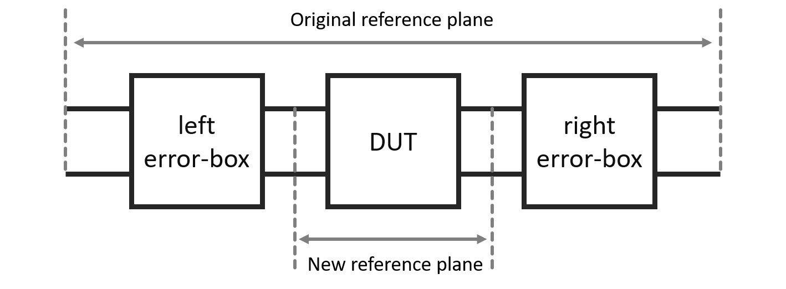
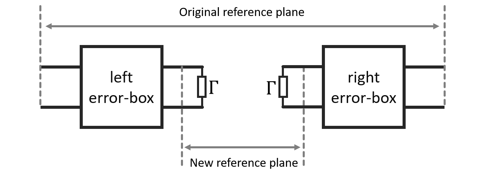

# TRL Calibration

When measuring a Device-Under-Test (DUT) with a VNA, we can describe the overall measurement model in terms of cascading the DUT with unknown “black-boxes”. We refer to such model as the error-box model:

Figure 1.: Error-box model of a VNA.

The goal of TRL calibration is to estimate the error-boxes, so that we can remove their effects by an inverse operation (de-cascading), and thus shift the measurement to the new reference plane. Some caveats you need to be aware of when using such model:

1. We assume here that the ports of the VNA are isolated from each other, i.e., leakage between the ports is negligible. This is generally true in most VNAs.
2. Switch terms must be corrected forehand. That is, everything we do from this points onwards assumes that your measurement were already switch-term-corrected. I will try to write a post about switch terms in the future, but for now, you can read more on switch terms in following papers:
    - R. B. Marks, "Formulations of the Basic Vector Network Analyzer Error Model including Switch-Terms," *50th ARFTG Conference Digest*, 1997, pp. 115-126
        
        [Formulations of the Basic Vector Network Analyzer Error Model including Switch-Terms](https://ieeexplore.ieee.org/document/4119948)
        
    - J. A. Jargon, D. F. Williams and A. Sanders, "The Relationship Between Switch-Term-Corrected Scattering-Parameters and Wave-Parameters Measured With a Two-Port Vector Network Analyzer," in *IEEE Microwave and Wireless Components Letters*, vol. 28, no. 10, pp. 951-953, Oct. 2018
        
        [The Relationship Between Switch-Term-Corrected Scattering-Parameters and Wave-Parameters Measured With a Two-Port Vector Network Analyzer](https://ieeexplore.ieee.org/document/8470059)
        

Now, that we cleared out the caveats with the error-box model, we can now delve into the math. The best way to describe the error-box model is by the T-parameters (also known as the chain parameters). The conversion between the S-parameters and T-parameters is give by

$$
\mathbf{T} = \frac{1}{S_{21}}\begin{bmatrix} S_{12}S_{21}-S_{11}S_{22} & S_{11}\\-S_{22} & 1\end{bmatrix} \qquad\tag{1}
$$

$$
\mathbf{S} = \frac{1}{T_{22}}\begin{bmatrix}T_{12} & T_{11}T_{22}-T_{12}T_{21}\\1 & -T_{21}\end{bmatrix}\qquad\tag{2}
$$

For example, if we have two devices connected in cascaded, their overall T-parameters is the matrix multiplication of both T-parameters, i.e., $\mathbf{T}_{total} = \mathbf{T}_{1}\mathbf{T}_{2}$. With the help of the T-parameters defemination, we can describe the error-box model in Figure 1 as

$$
\mathbf{M} = \underbrace{k_a\begin{bmatrix} a_{11} & a_{12}\\a_{21} & 1\end{bmatrix}}_{\text{left error-box}}\mathbf{T}_{DUT}\underbrace{\begin{bmatrix} b_{11} & b_{12}\\b_{21} & 1\end{bmatrix}k_b}_{\text{right error-box}}\qquad\tag{3}
$$

The parameters $\{k_a, a_{11}, a_{21}, a_{12}, k_b, b_{11}, b_{21}, b_{12}\}$ are the unknowns that we want to solve for. You can notice that we don’t really need to solve for $k_a$ and $k_b$ separately, we only need their product, thus we can simplify the model by defining $k=k_ak_b$. Thus, we only need to solve for 7-unknowns, and this simplifies Eq. (3) to

$$
\mathbf{M} = \underbrace{k_ak_b}_{k}\underbrace{\begin{bmatrix} a_{11} & a_{12}\\a_{21} & 1\end{bmatrix}}_{\mathbf{A}}\mathbf{T}_{DUT}\underbrace{\begin{bmatrix} b_{11} & b_{12}\\b_{21} & 1\end{bmatrix}}_{\mathbf{B}} = k\mathbf{A}\mathbf{T}_{DUT}\mathbf{B}\qquad\tag{4}
$$

Now, that we have the model established, we shift our focused on the details of TRL calibration. As the acronym stands for Thru-Reflect-Line, we are working with three standards. The start the calibration by measuring the Thru and Line standard, described in their T-paramters:

$$
\mathbf{M}_{Thru} = k\mathbf{A}\begin{bmatrix}1 & 0\\0 & 1\end{bmatrix}\mathbf{B}\qquad\tag{5}
$$

$$
\mathbf{M}_{Line} = k\mathbf{A}\begin{bmatrix}e^{-l\gamma} & 0\\0 & e^{l\gamma}\end{bmatrix}\mathbf{B}\qquad\tag{6}
$$

where $l$ is the length of the line (referenced to Thru) and $\gamma$  is the propagation constant. Note that the Thru standard is same as a Line standard but with $l=0$. Next step, we multiply the inverese of the Thru measurement with the Line measurement:

$$
\mathbf{M}_{Line}\mathbf{M}^{-1}_{Thru} = \mathbf{A}\begin{bmatrix}e^{-l\gamma} & 0\\0 & e^{l\gamma}\end{bmatrix}\mathbf{A}^{-1}\qquad\tag{7}
$$

Eq. (7) is an eigenvalue problem, where $e^{-l\gamma}$ and $e^{l\gamma}$ are the eigenvalues and $\mathbf{A}$ holds the two eigenvectors. We can also write Eq. (7) in the following way:

$$
\mathbf{M}_{Line}\mathbf{M}^{-1}_{Thru}\begin{bmatrix} a_{11}\\a_{21}\end{bmatrix} = e^{-l\gamma}\begin{bmatrix} a_{11}\\a_{21}\end{bmatrix};\qquad \mathbf{M}_{Line}\mathbf{M}^{-1}_{Thru}\begin{bmatrix} a_{12}\\1\end{bmatrix} = e^{l\gamma}\begin{bmatrix} a_{12}\\1\end{bmatrix}\qquad\tag{8}
$$

This means, if apply the eigen-decomposition on $\mathbf{M}_{Line}\mathbf{M}^{-1}_{Thru}$ we should get the matrix $\mathbf{A}$, right? Not completely, we have two issues to deal with:

1. When we apply the eigen-decomposition, the order of the eigenvalues is arbitrary. That means we need to sort the eigenvalues, which accordingly sort the eigenvectors to build $\mathbf{A}.$ From our point of view, we only the two eigenvalues as numbers, we don’t know which one represents $e^{-l\gamma}$ or $e^{l\gamma}$.
2. You should know from your Algebra 101, that the eigenvectors are unique up to a scalar multiple. That means, we can only solve the coefficients in $\mathbf{A}$ as normalized coefficients. Think about it this way, look at Eq. (8), if we multiple left side with a scalar, we would need to do the same on the right side. That is, any scalar multiple of the eigenvector is still a valid eigenvector.

To resolve the issue with sorting the eigenvalues, we compare the eigenvalues with an estimate we know. That is, we already have an estimate of $\gamma$ to build $e^{-l\gamma}$ and $e^{l\gamma}$. This estimate doesn’t need to be extremely accurate, but should be close enough to the right answer to allow us to distinguish the eigenvalues. Generally, the way this work, we start with an estimate of $\gamma$ at the first frequency point and solve the eigenvalue problem, and then extract the new $\gamma$  from the eigenvalues. This new $\gamma$ is your new estimate to use in the next frequency point.

Now, the way we solve for the coefficients is by normalizing them such that one element of the vector equals one. The equations in Eq. (8) become:

$$
\mathbf{M}_{Line}\mathbf{M}^{-1}_{Thru}\begin{bmatrix} 1\\a_{21}/a_{11}\end{bmatrix} = e^{-l\gamma}\begin{bmatrix} 1\\a_{21}/a_{11}\end{bmatrix};\qquad \mathbf{M}_{Line}\mathbf{M}^{-1}_{Thru}\begin{bmatrix} a_{12}\\1\end{bmatrix} = e^{l\gamma}\begin{bmatrix} a_{12}\\1\end{bmatrix}\qquad\tag{9}
$$

Note that $a_{12}$ doesn’t require normalization, as the eigenvector is already normalized. Now, suppose $\mathbf{v}_1$ is the computed eigenvector that corresponds to $e^{-l\gamma}$ and $\mathbf{v}_2$ is the eigenvector that corresponds to $e^{l\gamma}$. Then, $a_{21}/a_{11}$ and $a_{12}$ are computed as follows:

$$
a_{21}/a_{11} = \mathbf{v}_1[2]/\mathbf{v}_1[1]; \qquad a_{12} = \mathbf{v}_2[1]/\mathbf{v}_2[2]\qquad\tag{10}
$$

Before we discuss how to de-normalize the coefficient $a_{21}/a_{11}$, we first need to solve for the right error-box $\mathbf{B}$. Similar to Eq. (7), we can also write an eigenvaue problem for $\mathbf{B}$ as follows:

$$
(\mathbf{M}^{-1}_{Thru}\mathbf{M}_{Line})^T = \mathbf{B}^T\begin{bmatrix}e^{-l\gamma} & 0\\0 & e^{l\gamma}\end{bmatrix}(\mathbf{B}^T)^{-1}\qquad\tag{11}
$$

The transpose $(\cdot)^T$ is used here to push the inverse matrix to the right, otherwise, we would have it on the left. Now, similar to Eq. (9), we can write the eigenvalue problem as:

$$
(\mathbf{M}^{-1}_{Thru}\mathbf{M}_{Line})^T\begin{bmatrix} 1\\b_{12}/b_{11}\end{bmatrix} = e^{-l\gamma}\begin{bmatrix} 1\\b_{12}/b_{11}\end{bmatrix};\qquad (\mathbf{M}^{-1}_{Thru}\mathbf{M}_{Line})^T\begin{bmatrix} a_{21}\\1\end{bmatrix} = e^{l\gamma}\begin{bmatrix} a_{21}\\1\end{bmatrix}\qquad\tag{12}
$$

Remember that $\mathbf{B}^T = \begin{bmatrix}b_{11}&b_{21}\\b_{12}&1\end{bmatrix}$. Now, suppose $\mathbf{u}_1$ and $\mathbf{u}_2$ are the computed eigenvectors of $(\mathbf{M}^{-1}_{Thru}\mathbf{M}_{Line})^T$ that correspond to the eigenvalues $e^{-l\gamma}$ and $e^{l\gamma}$, respectively. Then $b_{12}/b_{11}$ and $b_{21}$ are solved as:

$$
b_{12}/b_{11} = \mathbf{u}_1[2]/\mathbf{u}_1[1];\qquad b_{21} = \mathbf{u}_2[1]/\mathbf{u}_2[2]\qquad\tag{13}
$$

To finalize the calibration, we need to de-normalize $a_{21}/a_{11}$ and $b_{12}/b_{11}$, and solve for $k$. The first what we can do is to use the Thru standard measurement and express the error-boxes in terms of their normalized coefficients. This looks something like:

$$
\mathbf{M}_{Thru} = k\underbrace{\begin{bmatrix} 1 & a_{12}\\a_{21}/a_{11} & 1\end{bmatrix}\begin{bmatrix} a_{11} & 0\\0 & 1\end{bmatrix}}_{\mathbf{A}}\underbrace{\begin{bmatrix} b_{11} & 0\\0 & 1\end{bmatrix}\begin{bmatrix} 1 & b_{12}/b_{11}\\b_{21} & 1\end{bmatrix}}_{\mathbf{B}}\qquad\tag{14}
$$

By taking the inverse of the normalized matrices, we get:

$$
\begin{bmatrix} 1 & a_{12}\\a_{21}/a_{11} & 1\end{bmatrix}^{-1}\mathbf{M}_{Thru}\begin{bmatrix} 1 & b_{12}/b_{11}\\b_{21} & 1\end{bmatrix}^{-1} = k\begin{bmatrix} a_{11} & 0\\0 & 1\end{bmatrix}\begin{bmatrix} b_{11} & 0\\0 & 1\end{bmatrix} = \begin{bmatrix} ka_{11}b_{11} & 0\\0 & k\end{bmatrix}\qquad\tag{15}
$$

So, from Eq. (15) we are able to solve for $k$. And with the help of $k$ we solve for $a_{11}b_{11}$ as

$$
a_{11}b_{11} = ka_{11}b_{11}/k\qquad\tag{16}
$$

The next step is to measure the reflect elements (no, I didn’t forget about them!). Since measuring the reflect is a single port measurement, the block diagram of the measurement looks as follows:

Figure 2.: Error-box model of VNA when measuring single port device.

In the figure above, $\Gamma$ is the reflection coefficient of the reflect standard. We don’t know its value, but it should be the same at both ports (i.e., both error-boxes see the same reflect standard). Generally, it is prefer to use a Short standard as it radiate less than an Open standard. But also a non-matching load could also be used. Additionally, it is preferred to add an offset length to the reflect standard. The offset is to ensure a single mode propagation at the new reference plane. 

The measured reflection seen at the left error-box is given by

$$
\Gamma_a = \frac{a_{12}+a_{11}\Gamma}{1+a_{21}\Gamma}\quad\Longrightarrow\quad \Gamma=\frac{\Gamma_a-a_{12}}{a_{11}-a_{21}\Gamma_a} \qquad\tag{17}
$$

A similar equation can be obtained for the right error-box:

$$
\Gamma_b = \frac{b_{11}\Gamma-b_{21}}{1-b_{12}\Gamma}\quad\Longrightarrow\quad \Gamma=\frac{\Gamma_b+b_{21}}{b_{11}+b_{12}\Gamma_b} \qquad\tag{18}
$$

You might be wondering now how I came with above equations, and why the measured reflection coefficient in the right error-box differs from the left error-box? Well, this comes from the famous formula for the input reflection coefficient measured from left (like with the left error-box):

$$
\Gamma_{in} = S_{11} + \frac{S_{12}S_{21}\Gamma}{1-S_{22}\Gamma} = \frac{S_{11}+(S_{12}S_{21}-S_{11}S_{22})\Gamma}{1-S_{22}\Gamma}\qquad\tag{19}
$$

The above equation so ubiquities, you can also find it on Wikipedia: [https://en.wikipedia.org/wiki/Scattering_parameters](https://en.wikipedia.org/wiki/Scattering_parameters)

Now, you simply substitute the S-parameters with their corresponding T-parameters. Since Eq. (19) is defined from left-to-right, you can’t use it as it is for the right error-box (right-to-left). For that, you first flip the S-parameters, i.e., $S_{11} \Leftrightarrow S_{22}$ and $S_{21} \Leftrightarrow S_{12}$, and then substitute with their corresponding T-parameters. That is why, the formula for the left and right reflection coefficient are different.

Coming back to the calibration. Since both reflect standers are the same at both ports, we can define the following ratio:

$$
\frac{a_{11}\Gamma}{b_{11}\Gamma}=\frac{a_{11}}{b_{11}} = \frac{\Gamma_a-a_{12}}{1-(a_{21}/a_{11})\Gamma_a}\frac{1+(b_{12}/b_{11})\Gamma_b}{\Gamma_b+b_{21}}\qquad\tag{20}
$$

So, now, we have $a_{11}b_{11}$ from the Thru measurement and $a_{11}/b_{11}$ from the reflect measurement. Thus, we can solve for $a_{11}$ and $b_{11}$ as follows:

$$
a_{11} = \pm\sqrt{\frac{a_{11}}{b_{11}}a_{11}b_{11}}; \quad b_{11} = \frac{a_{11}b_{11}}{a_{11}}\qquad\tag{21}
$$

To resolve the sign ambiguity, we choose the answer that will give a $\Gamma$ closest to the expected value. For example, if the reflect standard is a short, we expect $\Gamma$ to be close to -1. Of course, you want to take any offset into account if your reflect standard is offsetted by some length.

Now, that we have $a_{11}$ and $b_{11}$, the matrices $\mathbf{A}$ and $\mathbf{B}$ are obtained as:

$$
\mathbf{A}=\begin{bmatrix} 1 & a_{12}\\a_{21}/a_{11} & 1\end{bmatrix}\begin{bmatrix} a_{11} & 0\\0 & 1\end{bmatrix}; \qquad \mathbf{B} = \begin{bmatrix} b_{11} & 0\\0 & 1\end{bmatrix}\begin{bmatrix} 1 & b_{12}/b_{11}\\b_{21} & 1\end{bmatrix}\qquad\tag{22}
$$

And finally, your DUT can be calibrated using below equation

$$
\mathbf{T}_{DUT} = \frac{1}{k}\mathbf{A}^{-1}\mathbf{M}_{DUT}\mathbf{B}^{-1}\qquad\tag{23}
$$

You can convert back to S-parameters by using Eq. (2).

> **Cautionary:** 
Everything we derived here is based on the definition of T-parameters as given in Eqs. (1) and (2). Be carful with this, because there are authors that use a different, yet similar, definition for the T-parameters. For example, Michael Steer, in his open access books, he defines the T-parameters as: 
$\mathbf{T} = \frac{1}{S_{21}}\begin{bmatrix} 1 & -S_{22}\\S_{11} & S_{12}S_{21}-S_{11}S_{22}\end{bmatrix}$;    $\mathbf{S} = \frac{1}{T_{11}}\begin{bmatrix}T_{21} & T_{11}T_{22}-T_{12}T_{21}\\1 & -T_{12}\end{bmatrix}$
As you can see, the order in Michael Steer definition is different, but he is consistent with his ordering in the backward conversion. His equations are correct, but if you use it, you want to modify the equations I presented accordingly.
Check Michael Steer’s open access books (really good!): [https://repository.lib.ncsu.edu/handle/1840.20/36776](https://repository.lib.ncsu.edu/handle/1840.20/36776)
>